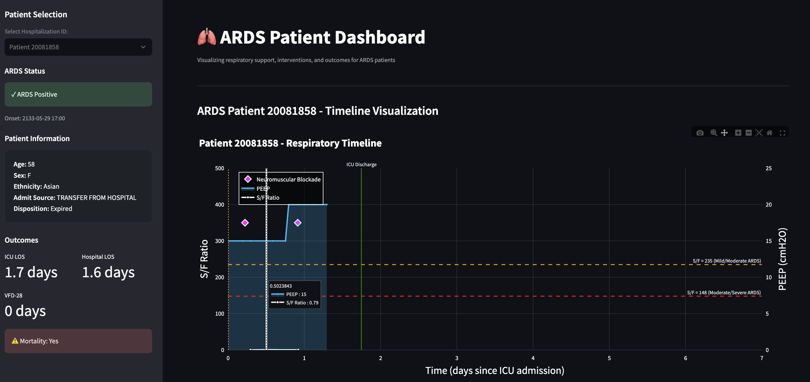

# ARDS Prone Positioning Analysis Project


A comprehensive analysis of prone positioning timing and its impact on outcomes in Acute Respiratory Distress Syndrome (ARDS) patients using large-scale electronic health record data.

## 🔬 Research Hypothesis

**We predict that individuals who are proned within the first quartile of ARDS diagnosis (based on S/F ratio) will have decreased mortality, shorter length of stay (LOS), and decreased time to extubation.**

This hypothesis investigates whether early prone positioning in the most severely ill ARDS patients (those in the first quartile based on SpO2/FiO2 ratio) leads to improved clinical outcomes.

## 📊 Dataset Overview


### MIMIC-IV Database
- **Patients**: 4,252 ARDS patients
- **Mortality Rate**: 23.5%
- **Mean Age**: 60.6 years
- **S/F Ratio Quartiles**: Q1=100.0, Q2=194.0, Q3=200.0
- **First Quartile Analysis**: 575 patients (most severe ARDS)
  - *Early prone positioning rate*: 0% (None proned within first quartile)

### eICU Collaborative Research Database
- **Patients**: 16,269 ARDS patients
- **Mean Age**: 62.4 years
- **S/F Ratio Quartiles**: Q1=100.0, Q2=163.3, Q3=206.7
- **First Quartile Analysis**: 2,531 patients (most severe ARDS)
  - *Early prone positioning rate*: 7.3% (186/2,531 patients)

## 🏗️ Project Structure

```
team_05/
├── app/                           # Streamlit Dashboard
│   ├── ards_dashboard.py         # Interactive patient trajectory visualization
│   └── requirements.txt          # Dashboard dependencies
├── code/                         # Analysis Notebooks
│   ├── mimic/                    # MIMIC-IV Analysis Pipeline
│   │   ├── 01_cohort_definition_optimized.ipynb
│   │   ├── 02_ards_identification_optimized.ipynb
│   │   ├── 03_analysis_dataset_creation.ipynb
│   │   ├── 04_statistical_analysis.ipynb
│   │   └── 05_regression_analysis.ipynb
│   └── eicu/                     # eICU Analysis Pipeline
│       ├── bigquery_setup.ipynb
│       └── 02_bigquery_exploded_ards.ipynb
├── reference_code/               # Reference Implementation
│   ├── ARDS-definitions-main/   # ARDS definition algorithms
│   └── ARDSFlag_all_functions.ipynb
├── tableone/                     # Summary Statistics
│   ├── table1_mimic.csv
│   └── table1_eicu.csv
└── data/                         # Processed Data
```

## 🚀 Key Features

### 1. **Multi-Dataset Analysis**
- MIMIC-IV (2008-2019): Comprehensive ICU data from Beth Israel Deaconess Medical Center
- eICU-CRD: Multi-center ICU database covering 335 units across the United States

### 2. **Advanced ARDS Detection**
- **Structured Data**: PEEP ≥5, SpO2/FiO2 ratio <315
- **Natural Language Processing**: Radiology report analysis for ARDS evidence
- **Temporal Analysis**: First 48-hour ICU admission window

### 3. **Interactive Dashboard**
- Real-time patient trajectory visualization
- Longitudinal clinical parameter tracking
- Prone positioning timeline analysis
- Outcome comparison tools

### 4. **Comprehensive Analysis Pipeline**
- Optimized cohort definition with vectorized operations
- Statistical analysis with multiple testing correction
- Regression modeling for outcome prediction
- Time-series analysis of clinical parameters

## 📋 Inclusion/Exclusion Criteria

### Inclusion Criteria
- ✅ Adults (≥18 years)
- ✅ At least one ICU admission
- ✅ PEEP ≥ 5 within first 48 hours of ICU admission
- ✅ S/F ratio < 315 at least once (SpO2/FiO2)
- ✅ At least one radiology report

### Exclusion Criteria
- ❌ Pregnant patients
- ❌ Patients with documented heart failure

## 🛠️ Installation & Setup

### Prerequisites
- Python 3.8+
- Access to MIMIC-IV and eICU databases (requires credentialed access)

### Environment Setup
```bash
# Clone the repository
git clone <repository-url>
cd team_05

# Install dependencies
pip install -r requirements.txt

# For dashboard only
pip install -r app/requirements.txt
```

### Database Configuration
1. Obtain credentialed access to MIMIC-IV and eICU databases
2. Update database paths in configuration files
3. Run setup notebooks to prepare analysis environment

## 🖥️ Running the Dashboard

```bash
# Navigate to app directory
cd app

# Launch Streamlit dashboard
streamlit run ards_dashboard.py
```


*Interactive ARDS Patient Dashboard showing longitudinal patient trajectory visualization*

The dashboard provides:
- **Patient Selection**: Filter by demographics, severity, and outcomes
- **Trajectory Visualization**: Longitudinal view of clinical parameters
- **Prone Positioning Analysis**: Timeline and outcome comparisons
- **Statistical Summaries**: Real-time cohort statistics

## 📈 Analysis Workflow

### 1. Data Preprocessing
- **MIMIC-IV**: Run notebooks in `code/mimic/` sequentially
- **eICU**: Execute BigQuery setup and analysis notebooks

### 2. Cohort Definition
```python
# Key inclusion criteria implementation
peep_criteria = df['peep'] >= 5
sf_ratio_criteria = df['sf_ratio'] < 315
age_criteria = df['age'] >= 18
```

### 3. Statistical Analysis
- Descriptive statistics and cohort characterization
- Survival analysis using Kaplan-Meier curves
- Logistic regression for mortality prediction
- Time-to-event analysis for extubation

### 4. Visualization & Reporting
- Generate Table 1 characteristics
- Create outcome comparison plots
- Export results for publication

## 📊 Key Findings

### Prone Positioning Utilization
- **MIMIC-IV**: No patients in the first quartile (most severe) received early prone positioning
- **eICU**: 7.3% of first quartile patients received early prone positioning
- **Gap Analysis**: Significant underutilization of evidence-based intervention in critically ill patients

### Clinical Implications
- Opportunity for quality improvement initiatives
- Need for standardized prone positioning protocols
- Potential for outcome improvement through early intervention

### Database & Infrastructure
- **SQL**: SQL (MIMIC-IV), BigQuery (eICU)
- **Notebooks**: Jupyter Notebook
- **Dashboard**: Streamlit

## 📚 Documentation

### Notebooks Overview
1. **01_cohort_definition**: Patient selection and inclusion criteria
2. **02_ards_identification**: ARDS detection algorithm implementation
3. **03_analysis_dataset**: Feature engineering and data preparation
4. **04_statistical_analysis**: Descriptive statistics and hypothesis testing
5. **05_regression_analysis**: Predictive modeling and outcome analysis

### Reference Materials
- ARDS definition algorithms in `reference_code/`
- Clinical guidelines and validation studies
- Database documentation and schema references

## 📄 License

This project is licensed under the MIT License - see the LICENSE file for details.

## 🏥 Clinical Relevance

This analysis addresses a critical gap in ARDS management by examining the timing of prone positioning relative to disease severity. The findings have direct implications for:

- **Clinical Practice Guidelines**: Informing evidence-based protocols
- **Quality Improvement**: Identifying opportunities for intervention optimization
- **Patient Outcomes**: Potentially reducing mortality and morbidity
- **Healthcare Policy**: Supporting resource allocation decisions
